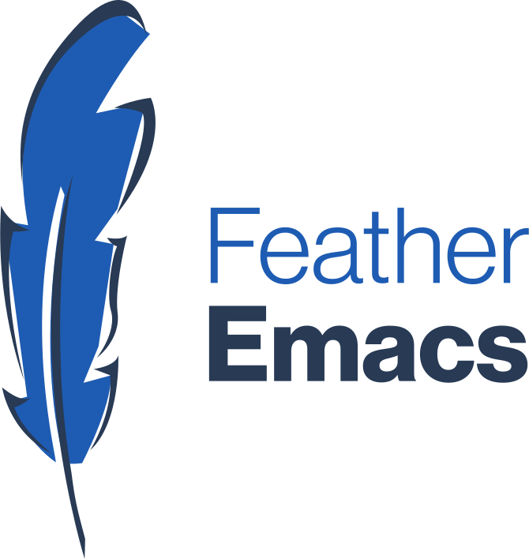

<a name="readme-top"></a>

<br />
<div align="center">
    <a href="https://github.com/stalecu/feather-emacs">
        <picture>
            <source media="(prefers-color-scheme: dark)" srcset="./assets/dark.svg">
            
        </picture>
    </a>
    <h3 align="center">Feather Emacs</h3>
    <p align="center">A personal configuration for Emacs</p>
</div>
<br />

## About The Project

This repo is all about my personal Emacs configuration. This will
serve as my attempt to confront my Emacs bankrupcy and, more
importantly, make it pretty and functional.

The feather in Feather Emacs is a homage to Tcl/Tk, one of my favorite
programming languages, as well as my attempt at making it lightweight.

By no means am I trying to build the next Doom Emacs, Spacemacs etc.,
but I hope it will serve as inspiration to someone out there. Or
me. Who knows?

This will also serve as my own playground for experimenting and
developing LSPs and Tree-sitter grammars.

<p align="right">(<a href="#readme-top">back to top</a>)</p>


## Getting Started

### Prerequisites

I am running on the latest Emacs, so something like Emacs 28.1 would
be great to have (I am on 29.2 at the moment of writing). I will
attempt to make it work on Emacs 28 and 27, but I don't want to go
back further than that for now.

<p align="right">(<a href="#readme-top">back to top</a>)</p>

### Installation

```shell
git clone https://github.com/stalecu/feather-emacs ~/.config/emacs 
```

<p align="right">(<a href="#readme-top">back to top</a>)</p>


## Roadmap

- [ ] Tcl/Tk support
- [ ] Pascal support
- [ ] Ada support
- [ ] C++ support
- [ ] Building my own theme
- [ ] Spawning Cthulhu in an Emacs buffer
- [ ] Other things here

See the [open issues](https://github.com/stalecu/feather-emacs/issues)
for a full list of proposed features (and known issues).

<p align="right">(<a href="#readme-top">back to top</a>)</p>


## Contributing

Contributions are what make the open source community such an amazing
place to learn, inspire, and create. Any contributions you make are
**greatly appreciated**, even though this is, at the end of the day,
my own personal configuration.

If you have a suggestion that would make this better, please fork the
repo and create a pull request. You can also simply open an issue with
the tag "enhancement".  Don't forget to give the project a star!
Thanks again!

1. Fork the Project
2. Create your Feature Branch (`git checkout -b feature/AmazingFeature`)
3. Commit your Changes (`git commit -m 'Add some AmazingFeature'`)
4. Push to the Branch (`git push origin feature/AmazingFeature`)
5. Open a Pull Request

<p align="right">(<a href="#readme-top">back to top</a>)</p>

## License

Distributed under the GNU General Public License 3.0. See `LICENSE`
for more information.

<p align="right">(<a href="#readme-top">back to top</a>)</p>


